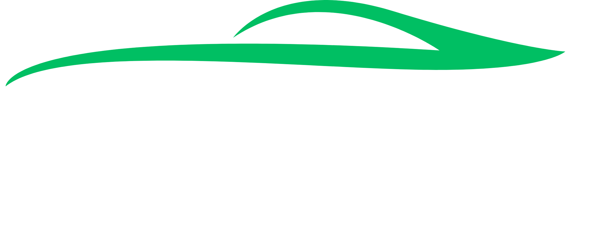

# Whale Xe - Mobile Rental App (Android)



*Drive Your Journey with Effortless Car Rentals – On Mobile*


---

## Table of Contents

- [Overview](#overview)
- [Features](#features)
- [Project Structure](#project-structure)
- [Getting Started](#getting-started)
- [Usage](#usage)
- [Development](#development)
- [License](#license)

---

## Overview

Whale Xe is a mobile application for a car rental service built using Java/Kotlin and Android Studio. This project delivers a clean, smooth, and animated experience for users renting vehicles on their mobile devices. It’s tailored for both educational use and real-world usability, with engaging interfaces and essential features for login, registration, and introductions.

---

## Features

- 🎬 **Animated Introduction Screens**: Welcomes users with interactive and visually appealing transitions.
- 🔐 **User Authentication**: Includes Login and Registration capabilities.
- 💫 **Smooth Page Transitions**: Custom animations between activities.
- 🧭 **Modern UI/UX Design**: Responsive layouts and custom fonts.

---

## Project Structure

```text
app/
├── src/
│   ├── main/
│   │   ├── java/
│   │   │   └── com/
│   │   │       └── midterm/
│   │   │           └── mobiledesignfinalterm/
│   │   │               ├── Introduce/
│   │   │               │   └── IntroduceActivity.java
│   │   │               ├── authentication/
│   │   │               │   ├── Login.java
│   │   │               │   └── Register.java
│   │   │               └── MainActivity.java
│   │   ├── res/
│   │   │   ├── anim/
│   │   │   │   ├── slide_in_left.xml
│   │   │   │   ├── slide_out_left.xml
│   │   │   │   └── slide_out_right.xml
│   │   │   ├── layout/
│   │   │   │   ├── activity_introduce.xml
│   │   │   │   ├── activity_login.xml
│   │   │   │   └── activity_register.xml
│   │   │   ├── font/
│   │   │   │   └── notosans_semibold.ttf
│   │   │   └── drawable/
│   │   │       ├── intro_bg_1.png
│   │   │       ├── intro_bg_2.png
│   │   │       ├── intro_bg_3.png
│   │   │       ├── page_indicator_active.xml
│   │   │       └── page_indicator_inactive.xml
│   │   └── AndroidManifest.xml
├── build.gradle
└── README.md
```
## Getting Started

1. Prerequisites
2. Ensure the following are installed:

## Android Studio

- Java Development Kit (JDK 8 or higher)

- Android SDK

## Installation

1. Clone the repository
```
git clone https://github.com/AkioCkist/CarAppMobieDesign.git
cd MobileDesignFinalTerm
```
2. Open in Android Studio

3. Open Android Studio.

4. Select "Open an Existing Project" and locate the cloned repository.

## Build & Run

- Choose a device/emulator and click Run.

## Usage

Launch the app to experience the animated onboarding, followed by the login or registration page. Once authenticated, users are directed to the main interface.

## Development

1. To start developing:

2. Make sure your IDE (Android Studio) is set up with Gradle sync.

3. All animations and transitions can be modified under res/anim.

4. UI layouts are managed in res/layout.

5. Java classes are organized under Introduce, authentication, and the root activity.

## License

___This project is for educational purposes.___

***Crafted with 💡 and 🎨 for the Whale Xe Mobile Final Term Project.***
